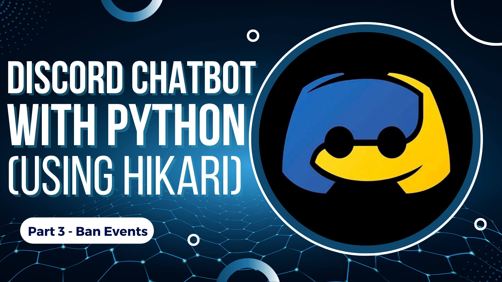

# Part 3 - Ban Events

This is the third episode of this series Creating a Discord Bot with Python using Hikari API. 
In this [video](https://youtu.be/yFiHXrp5k9Q) we will be focusing on events triggered when a user's Ban status is modified and understand their Properties


[](https://youtu.be/yFiHXrp5k9Q)
## Types of Ban Events

```python
hikari.BanEvent                 #Triggered for all Ban status change events
hikari.BanCreateEvent           #Triggered when a user is banned from a server
hikari.BanDeleteEvent  #Triggered when a user's ban is revoked from a server

```


## GuildMessageCreateEvent Properties 

```python
    Author = event.author           #Returns Username#1234
    Author_ID = event.author_id     #Returns Unique Numeric UserID
    Content = event.content         #Returns Text of Message as a String
    Embed = event.embeds            #Returns Embed of Message
    Message = event.message         #Returns all data of Message as a Dictionary
    Message_ID = event.message_id   #Returns Unique Numeric MessageID
    Channel_ID = event.channel_id   #Returns Unique Numeric ChannelID
    Guild_ID = event.guild_id       #Returns Unique Numeric GuildID
    Bot = event.is_bot              #Returns True or False
    Human = event.is_human          #Returns True or False
    Webhook = event.is_webhook      #Returns True or False
```

## DMMessageCreateEvent Properties

```python
    Author = event.author           #Returns Username#1234
    Author_ID = event.author_id     #Returns Unique Numeric UserID
    Content = event.content         #Returns Text of Message as a String
    Embed = event.embeds            #Returns Embed of Message
    Message = event.message         #Returns all data of Message as a Dictionary
    Message_ID = event.message_id   #Returns Unique Numeric MessageID
    Bot = event.is_bot              #Returns True or False
    Human = event.is_human          #Returns True or False
    Webhook = event.is_webhook      #Returns True or False
```

## Resources

[Hikari Documentation for Ban Events](https://www.hikari-py.dev/hikari/events/guild_events.html#hikari.events.guild_events.BanEvent)
Read the docs for better understanding of the code.

[Discord Developer](https://discord.com/developers/applications)
Create your very own Discord Bot here!

## License

[MIT](https://github.com/kshgr/Discord-Bot-with-Python-using-Hikari/blob/main/LICENSE)
